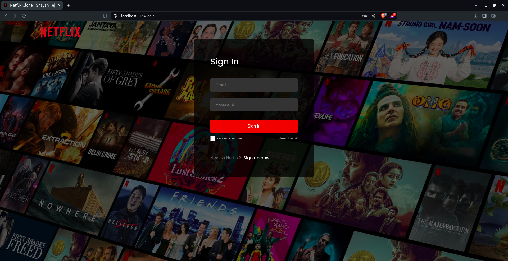
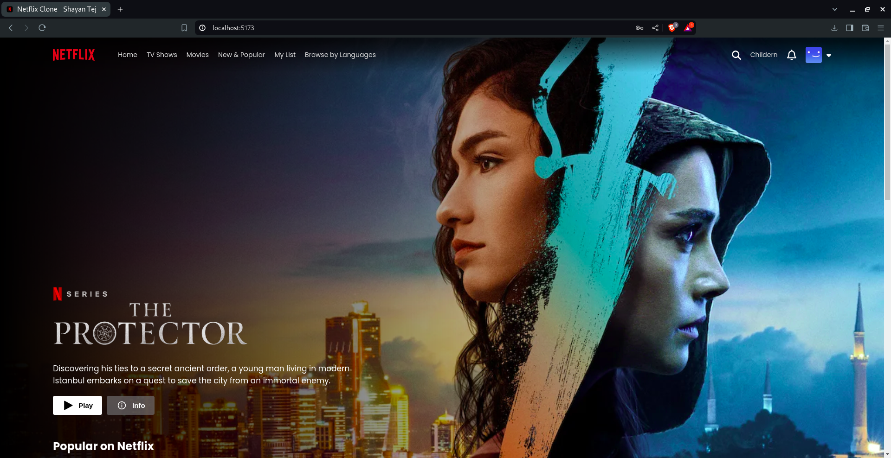
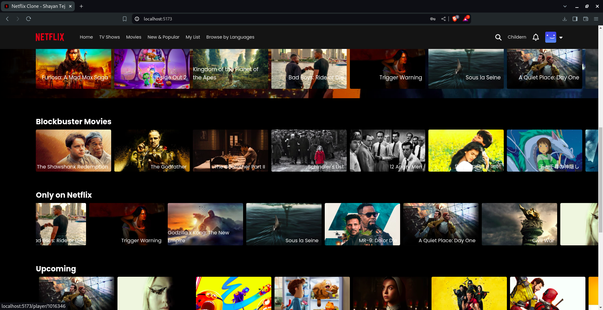
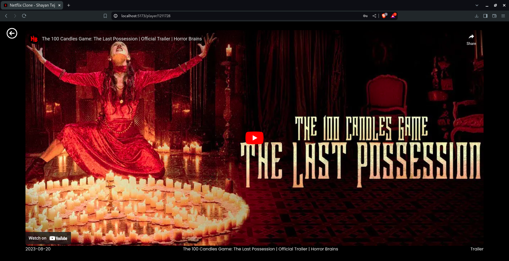

# Netflix Clone

[](https://nodejs.org/)
[](https://vitejs.dev/)
[](https://opensource.org/licenses/MIT)

A Netflix clone built with Vite + React.js, featuring Firebase authentication and movie data fetched from the IMDb API. This project includes a login page, a home page displaying movie categories, and a player page to watch movie trailers or teasers.

## Table of Contents

- [Features](#features)
- [Technologies Used](#technologies-used)
- [Setup](#setup)
- [Usage](#usage)
- [Screenshots](#screenshots)
- [Project Structure](#project-structure)
- [Contributing](#contributing)
- [License](#license)

## Features

- **Responsive Design**: The application is fully responsive and works on various devices.
- **Firebase Authentication**: Secure user login using Firebase.
- **IMDb API Integration**: Fetches movie categories and details from IMDb API.
- **Trailer Player**: Watch trailers or teasers on the player page.

## Technologies Used

- **Frontend**: Vite, React.js, React Router
- **Authentication**: Firebase
- **Data Source**: IMDb API
- **Styling**: CSS

## Setup

1. **Clone the repository**

    ```bash
    git clone https://github.com/shayan-tej/netflix-clone.git
    cd netflix-clone
    ```

2. **Install dependencies**

    ```bash
    npm install
    ```

3. **Configure Firebase**

    - Go to [Firebase Console](https://console.firebase.google.com/).
    - Create a new project.
    - Navigate to the project settings, add a web app, and copy the Firebase configuration.
    - Create a `.env` file in the root directory and add your Firebase credentials:

    ```env
    VITE_FIREBASE_API_KEY=your_firebase_api_key
    VITE_FIREBASE_AUTH_DOMAIN=your_firebase_auth_domain
    VITE_FIREBASE_PROJECT_ID=your_firebase_project_id
    VITE_FIREBASE_STORAGE_BUCKET=your_firebase_storage_bucket
    VITE_FIREBASE_MESSAGING_SENDER_ID=your_firebase_messaging_sender_id
    VITE_FIREBASE_APP_ID=your_firebase_app_id
    ```

4. **Set Up IMDb API**

    - Get your API key from [IMDb API](https://imdb-api.com/).

5. **Run the application**

    ```bash
    npm run dev
    ```

## Usage

- **Login Page**: Users can log in using their credentials. Firebase handles the authentication.
- **Home Page**: Displays movie categories fetched from IMDb. Click on a movie to navigate to the player page.
- **Player Page**: Shows the trailer or teaser of the selected movie.

## Screenshots

### Sign In Page:


### Home Page:



### Player Page:


## Project Structure

```plaintext
netflix-clone/
├── src/
│   ├── assets/
│   ├── components/
│   ├── pages/
│   │   ├── HomePage.jsx
│   │   ├── LoginPage.jsx
│   │   ├── PlayerPage.jsx
│   ├── App.jsx
│   ├── main.jsx
│   └── ...
├── index.html
├── package.json
├── README.md
└── ...
```

- `public/`: Public assets and files.
- `src/`: Source code including components and pages.
- `assets/`: Static assets like images and icons.
- `components/`: Reusable components.
- `pages/`: Specific pages like Login, Home, and Player.


## Contributing

Contributions are welcome! Please create an issue or submit a pull request for any enhancements or bug fixes.

## License

This project is licensed under the MIT License - see the LICENSE file for details.

### Notes:

```
1. **Replace** the placeholder URLs and keys with your actual repository URL and API keys.
2. **Add** more detailed sections as needed, like screenshots, deployment instructions, or additional features.
3. **Include** any additional instructions for configuring Firebase or IMDb API if necessary.

This template should provide a clear and organized starting point for anyone who wants to use or contribute to your project.
```
